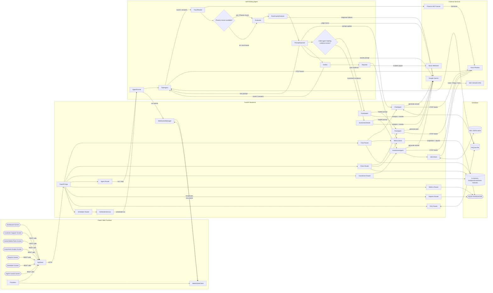

# Self-Healing Agent Architecture

## Section 1: System Overview

The Self-Healing Agent is a multi-surface AI application that serves three live experiences: a customer-support chatbot, a social-media post generator, and an SEC-grounded investment analyst. Its distinguishing feature is a supervisory self-healing loop that evaluates recent behavior, diagnoses failure modes, rewrites prompts, verifies improvement, and records incident reports plus metrics for operators. Human users interact through a Flutter web dashboard, while a FastAPI backend coordinates agents, persistence, scheduling, tracing, and live WebSocket updates. The system is designed for demos and judging: it visibly shows weak initial behavior, automated prompt repair, trace observability through self-hosted Arize Phoenix, and before/after evidence in the UI.

## Section 2: Component Inventory

| Component | Technology | Port | What it does | Location |
|---|---|---:|---|---|
| Flutter Web Dashboard | Flutter / Dart / Provider / go_router | Served by backend; dev typically 3000 | Browser UI for dashboard, chat, posts, investment research, reports, schedules, and agent control. | `dashboard/lib/` |
| FastAPI application | Python / FastAPI / Uvicorn | Local 8000; Cloud Run container 8080 | Hosts REST APIs, WebSocket endpoint, bundled Flutter assets, startup lifecycle, and route composition. | `backend/main.py` |
| Customer Support Chat Agent | Python / Gemini / OpenTelemetry | none | Answers FAQ-grounded customer questions with prompt-version tracking and traces. | `backend/services/chat_agent.py` |
| Social Media Post Agent | Python / Gemini / OpenTelemetry | none | Generates posts from briefs and tracks prompt versions. | `backend/services/post_agent.py` |
| Investment Analyst Agent | Python / Gemini / SEC client / OpenTelemetry | none | Produces SEC-grounded investment research answers and safety evaluations. | `backend/services/investment_agent.py` |
| Self-Healing Supervisor | Python classes | none | Runs the end-to-end evaluate → analyze → improve → verify → report workflow. | `backend/services/agent_runner.py`, `agent/` |
| Metrics / Report Store | SQLAlchemy async | none | Persists metric snapshots and incident reports into SQLite. | `backend/services/metrics_store.py`, `backend/database.py` |
| Scheduler Service | APScheduler | none | Loads enabled schedules and triggers future self-healing runs. | `backend/services/scheduler_svc.py` |
| SQLite Dashboard Database | SQLite | file-backed | Stores metrics, reports, and schedules. | `data/dashboard.db` |
| FAQ Knowledge Base | Plain text | none | Ground-truth support content used by the support agent, evaluators, and FAQ editor. | `data/faq.txt` |
| SEC Cache | JSON files | none | Local cache for ticker mappings, submissions, and XBRL company facts. | `data/sec_cache/` |
| Phoenix Tracing | Arize Phoenix + OTLP HTTP | Local 6006; Cloud Run 6006 | Receives traces and exposes trace reads used by the self-healing loop. | external service configured by `config/phoenix_tracing.py`, deployed via `deploy/cloudrun/` |
| Phoenix MCP Trace Reader | Python MCP client + `@arizeai/phoenix-mcp` | none | Reads recent Phoenix traces through the official MCP server. | `agent/trace_reader.py` |
| Deployment Scripts | Bash / Docker | none | Deploy Phoenix and backend to Cloud Run and document environment configuration. | `deploy/` |

## Section 3: Data Flow — The Self-Healing Loop

1. **Step 1: Agent Control Screen → FastAPI Agent Router**  
   **Action:** User clicks **Run Agent Now**; Flutter calls `POST /api/agent/run`.  
   **Data:** Empty JSON body; API returns `run_id` and `status`.

2. **Step 2: Agent Router → AgentRunner**  
   **Action:** Router schedules `agent_runner.run_agent(run_id)` as a background task.  
   **Data:** UUID run identifier.

3. **Step 3: AgentRunner → WebSocketManager → Flutter listeners**  
   **Action:** Runner broadcasts start state.  
   **Data:** `run:<run_id>:started`.

4. **Step 4: AgentRunner → TaskAgent**  
   **Action:** Runner loads up to 10 FAQ questions and starts round 1; `TaskAgent.answer()` answers each question.  
   **Data:** Question strings from `data/faq.txt`; answer text and latency per question.

5. **Step 5: TaskAgent → Phoenix**  
   **Action:** Each support answer is wrapped in an OpenTelemetry span and exported when Phoenix is reachable.  
   **Data:** `input.value`, `output.value`, `latency_ms`, model name, project name.

6. **Step 6: AgentRunner → WebSocketManager**  
   **Action:** Runner marks round 1 in progress.  
   **Data:** `run:<run_id>:round_1_started`.

7. **Step 7: AgentRunner → TraceReader → Phoenix MCP**  
   **Action:** Runner requests recent Phoenix traces through the official MCP server; if unavailable, it falls back to locally collected round-1 traces.  
   **Data:** MCP tool call `list-traces` with `project_name` and `limit`.

8. **Step 8: AgentRunner → Evaluator**  
   **Action:** Evaluator scores traces for hallucination, relevance, and latency using Gemini when enabled, otherwise deterministic local rules.  
   **Data:** Trace list; returns batch averages, per-trace scores, and problematic traces.

9. **Step 9: AgentRunner → WebSocketManager**  
   **Action:** Runner broadcasts evaluation completion.  
   **Data:** `run:<run_id>:evaluated`.

10. **Step 10: AgentRunner → RootCauseAnalyzer**  
    **Action:** Analyzer classifies the dominant failure mode from problematic traces.  
    **Data:** Problematic traces; returns category such as `GUESSING`, `IRRELEVANT`, `INCOMPLETE`, or `HALLUCINATION` plus explanation.

11. **Step 11: AgentRunner → WebSocketManager**  
    **Action:** Runner broadcasts analysis completion.  
    **Data:** `run:<run_id>:analyzed:<category>`.

12. **Step 12: AgentRunner → PromptImprover → TaskAgent**  
    **Action:** Improver rewrites the support prompt; runner applies it to the verification agent.  
    **Data:** Old prompt + root cause → new prompt.

13. **Step 13: AgentRunner → live child agents**  
    **Action:** Runner updates the singleton chat prompt, then optionally heals recent post and investment failures and updates those prompts if those healers return a result.  
    **Data:** New support prompt to `chat_agent`; healed prompts to `post_agent` and `investment_agent` when evidence exists.

14. **Step 14: AgentRunner → WebSocketManager → Flutter listeners**  
    **Action:** Runner broadcasts prompt changes.  
    **Data:** `prompt_updated:v<n>`, optional `post_prompt_updated:v<n>`, optional `investment_prompt_updated:v<n>`, and `run:<run_id>:prompt_updated`.

15. **Step 15: AgentRunner → Verifier → TaskAgent**  
    **Action:** Verifier reruns the same FAQ questions against the improved prompt and scores the second pass.  
    **Data:** Original questions, previous evaluation, updated agent; returns before/after metrics and verification traces.

16. **Step 16: TaskAgent → Phoenix**  
    **Action:** Verification answers are traced like round 1 answers.  
    **Data:** Verification spans with answer attributes and latency.

17. **Step 17: AgentRunner → WebSocketManager**  
    **Action:** Runner broadcasts verification completion and may publish before/after answer examples for the healing journey dialog.  
    **Data:** `run:<run_id>:verified`; optional `comparisons_ready:<json payload>`.

18. **Step 18: AgentRunner → Reporter → filesystem / Slack**  
    **Action:** Reporter writes a plain-text incident report to `reports/` and optionally posts it to Slack when configured.  
    **Data:** Evaluation, root cause, verification, old prompt, new prompt; report text.

19. **Step 19: AgentRunner → MetricsStore → SQLite**  
    **Action:** Runner persists the run metric snapshot and report row.  
    **Data:** `MetricSnapshot` fields and parsed `Report` fields saved to `metric_snapshots` and `reports`.

20. **Step 20: AgentRunner → WebSocketManager → dashboard providers**  
    **Action:** Runner broadcasts completion; UI providers refresh summary/chart/report views when they see completion or prompt-update messages.  
    **Data:** `run:<run_id>:completed`.  
    **End state:** Incident report saved and chart updated.

## Section 4: Data Flow — Chat Message

1. **Step 1: Customer Support Screen → Chat Router**  
   **Action:** User types a message and hits send; Flutter posts to `POST /api/chat/message`.  
   **Data:** `{message, session_id}`.

2. **Step 2: Chat Router → in-memory chat session store**  
   **Action:** Router creates or reuses a session ID and appends the user message.  
   **Data:** `ChatMessage(role='user', content, timestamp)`.

3. **Step 3: Chat Router → ChatAgent**  
   **Action:** `chat_agent.answer()` generates an answer using the current prompt and FAQ context.  
   **Data:** User message; returns answer, latency, trace ID, prompt version.

4. **Step 4: ChatAgent → Phoenix**  
   **Action:** The answer call emits an OpenTelemetry span when tracing is available.  
   **Data:** Chat trace attributes including input, output, latency, and prompt version.

5. **Step 5: Chat Router → in-memory chat session store**  
   **Action:** Router appends the agent reply.  
   **Data:** `ChatMessage(role='agent', content, latency_ms, trace_id)`.

6. **Step 6: Chat Router → ChatScorer**  
   **Action:** Router scores the question/answer pair with Gemini judge or rule fallback.  
   **Data:** Question, answer, prompt version; returns hallucination and relevance scores.

7. **Step 7: Chat Router → MetricsStore → SQLite**  
   **Action:** Router wraps the score in lightweight evaluation objects and saves one metric snapshot.  
   **Data:** Run ID like `chat-<id>`, scores, latency → `metric_snapshots` row.

8. **Step 8: Chat Router → WebSocketManager**  
   **Action:** Router broadcasts metric and chat refresh signals.  
   **Data:** `metrics_updated`, then `chat_update:<session_id>:v<prompt_version>`.

9. **Step 9: WebSocket listeners → Flutter providers/screens**  
   **Action:** `MetricsProvider` reloads summary and chart data when `metrics_updated` arrives; chat UI receives the HTTP response and displays the reply.  
   **Data:** Fresh metric API responses and `ChatResponse` payload.  
   **End state:** Chart updates with new hallucination score.

## Section 5: Data Flow — Social Media Post

1. **Step 1: Social Media Posts Screen → Posts Router**  
   **Action:** User pastes a brief and clicks **Generate**; Flutter calls `POST /api/posts/generate`.  
   **Data:** `{brief, platform}`.

2. **Step 2: Posts Router → PostAgent**  
   **Action:** `post_agent.generate()` creates a post using the active post prompt.  
   **Data:** Brief and platform; returns post text, latency, trace ID, prompt version.

3. **Step 3: PostAgent → Phoenix**  
   **Action:** The generation call emits a tracing span when Phoenix is reachable.  
   **Data:** Brief, generated post, platform, prompt version, latency.

4. **Step 4: Posts Router → PostScorer**  
   **Action:** Router evaluates hallucination and relevance using Gemini or fallback rules.  
   **Data:** Brief, generated post, prompt version; returns scores.

5. **Step 5: Posts Router → in-memory post history store**  
   **Action:** Router saves the generated post entry for history and future healing evidence.  
   **Data:** Post ID, timestamp, brief, platform, post, scores, latency, trace ID.

6. **Step 6: Posts Router → MetricsStore → SQLite**  
   **Action:** Router stores a metric snapshot for the generation.  
   **Data:** Run ID like `post-<id>` and generated scores.

7. **Step 7: Posts Router → WebSocketManager**  
   **Action:** Router broadcasts a metric refresh event.  
   **Data:** `metrics_updated`.

8. **Step 8: Posts Router → Social Media Posts Screen**  
   **Action:** API returns the generated post payload, and Flutter renders the post plus badges.  
   **Data:** `PostResponse` with post text, platform, latency, trace ID, prompt version, hallucination score, relevance score.  
   **End state:** Post displayed with hallucination score badge.

9. **Step 9: Social Media Posts Screen → Posts Router healing endpoint**  
   **Action:** When hallucination is high, or the user clicks **Regenerate**, Flutter calls `POST /api/posts/heal` and stores the current post as the before-healing baseline.  
   **Data:** Current post, brief, platform, prompt version, and scores remain in the screen state; the router reads recent post history as healing evidence.

10. **Step 10: Posts Router → PostHealer → PostAgent**  
    **Action:** `post_healer.heal_recent_posts()` diagnoses failed post history, appends a learned grounding constraint or retry rule, verifies a candidate post, and the router updates `post_agent` when a prompt change is needed.  
    **Data:** Root cause, old prompt, new prompt, before/after scores, verification traces, and a healed preview.

11. **Step 11: Posts Router → Social Media Posts Screen comparison UI**  
    **Action:** The heal response returns the evidence payload immediately; `post_prompt_updated:v<n>` also lets the screen auto-regenerate the pending brief with the healed prompt. The UI exposes **View Comparison** and **View Healing** for the stored before/after pair. If no prompt change is needed after prompt v2+, the screen regenerates with the current healed prompt instead of consuming a useful retry.  
    **Data:** `{status, prompt_version, root_cause, root_cause_explanation, old_prompt, new_prompt, before_scores, after_scores, verification_traces, preview}`.

## Section 6: Database Schema

| Table | Columns and types | What it stores | Readers / writers |
|---|---|---|---|
| `metric_snapshots` | `id INTEGER PK`; `timestamp DATETIME`; `hallucination_score FLOAT`; `relevance_score FLOAT`; `latency_ms FLOAT`; `improvement_percent FLOAT`; `run_id VARCHAR(120)` | Point-in-time quality metrics for dashboard charts and cards. | Written by `MetricsStore.save_run_metrics`; read by `metrics` routes, `/embed/widget`, dashboard metrics providers. |
| `reports` | `id INTEGER PK`; `timestamp DATETIME`; `run_id VARCHAR(120)`; `problem TEXT`; `root_cause TEXT`; `fix_applied TEXT`; `before_hallucination FLOAT`; `before_relevance FLOAT`; `before_latency FLOAT`; `after_hallucination FLOAT`; `after_relevance FLOAT`; `after_latency FLOAT`; `improvement_percent FLOAT`; `human_needed BOOLEAN`; `content_text TEXT` | Persisted incident reports from completed self-healing runs. | Written by `MetricsStore.save_report`; read by `reports` routes and `/embed/widget`. |
| `schedules` | `id INTEGER PK`; `name VARCHAR(120)`; `interval_minutes INTEGER`; `enabled BOOLEAN`; `last_run DATETIME nullable`; `next_run DATETIME nullable`; `run_count INTEGER` | User-managed recurring run definitions. | Written by `scheduler` routes / `SchedulerService`; read by scheduler routes and `SchedulerService.load_schedules`. |

**Additional non-SQL stores:** `sessions` in `backend/routes/chat.py`, `sessions` in `backend/routes/investment.py`, `backend/services/post_history_store.py`, and `backend/services/investment_history_store.py` are in-memory only; `data/faq.txt` is a text knowledge store; `data/sec_cache/*.json` are SEC cache files.

## Section 7: API Endpoints

### `backend/main.py`

| Method | Path | What it does | Request body | Response shape |
|---|---|---|---|---|
| GET | `/health` | Returns environment-safe service health/config summary. | none | `{status, app_env, phoenix_host, phoenix_collector_endpoint, project}` |
| GET | `/` | Serves Flutter `index.html` if bundled, otherwise status JSON. | none | HTML file or `{status, message}` |
| GET | `/embed/widget` | Returns an iframe-friendly HTML widget with latest health/report info. | none | HTML |
| WebSocket | `/ws` | Accepts live dashboard connections. | text frames from client are ignored | server text events |
| GET | `/{full_path:path}` | Serves Flutter asset or SPA fallback `index.html`. | none | file response or `{detail}` |

### `backend/routes/agent.py`

| Method | Path | What it does | Request body | Response shape |
|---|---|---|---|---|
| POST | `/api/agent/run` | Starts a background self-healing run. | none | `{run_id, status}` |
| POST | `/api/agent/stop` | Requests graceful stop. | none | `{run_id, status}` |
| GET | `/api/agent/status` | Returns runner state. | none | `{status, running, last_run, next_run, current_run_id, last_error}` |

### `backend/routes/chat.py`

| Method | Path | What it does | Request body | Response shape |
|---|---|---|---|---|
| POST | `/api/chat/message` | Sends one support chat message and gets an answer. | `{message, session_id}` | `{answer, latency_ms, trace_id, prompt_version, session_id}` |
| GET | `/api/chat/history/{session_id}` | Returns recent messages for a session. | none | `[{role, content, timestamp, latency_ms, trace_id}]` |
| GET | `/api/chat/status` | Returns singleton chat-agent status. | none | `{prompt_version, conversation_count, current_prompt, faq_loaded}` |
| POST | `/api/chat/reset` | Resets chat agent and clears sessions. | none | `{status, prompt_version}` |

### `backend/routes/faq.py`

| Method | Path | What it does | Request body | Response shape |
|---|---|---|---|---|
| GET | `/api/faq` | Reads the FAQ file. | none | `{content}` |
| PUT | `/api/faq` | Replaces the FAQ file. | `{content}` | `{status, content}` |

### `backend/routes/investment.py`

| Method | Path | What it does | Request body | Response shape |
|---|---|---|---|---|
| POST | `/api/investment/message` | Answers an SEC-grounded investment question. | `{message, ticker, session_id}` | `{answer, ticker, latency_ms, trace_id, prompt_version, session_id, sources, risk_flags, sec_context}` |
| GET | `/api/investment/status` | Returns investment-agent status. | none | status dict from agent |
| GET | `/api/investment/history/{session_id}` | Returns recent investment messages. | none | `[{role, content, timestamp, latency_ms, trace_id, ticker}]` |
| POST | `/api/investment/reset` | Resets investment agent and clears in-memory history. | none | `{status, prompt_version}` |
| GET | `/api/investment/tickers` | Returns cached SEC ticker mapping. | none | `{count, tickers}` |
| GET | `/api/investment/sec/{ticker}` | Returns SEC research context for ticker. | none | research-context object; `404` if unavailable |
| POST | `/api/investment/evaluate` | Scores answer safety/grounding. | `{question, answer, ticker}` | evaluation dict with flags and quality score |

### `backend/routes/metrics.py`

| Method | Path | What it does | Request body | Response shape |
|---|---|---|---|---|
| GET | `/api/metrics/latest` | Returns newest 10 metric snapshots. | none | `[{id, timestamp, hallucination_score, relevance_score, latency_ms, improvement_percent, run_id}]` |
| GET | `/api/metrics/range?period=...` | Returns period points and averages. | none | `{period, since, count, averages, points}` |
| GET | `/api/metrics/summary` | Returns latest health summary. | none | `{health_score, hallucination_score, relevance_score, latency_ms, improvement_percent, snapshot_count}` |

### `backend/routes/phoenix.py`

| Method | Path | What it does | Request body | Response shape |
|---|---|---|---|---|
| GET | `/api/phoenix/traces?refresh=true` | Returns recent trace evidence for the dashboard, optionally attempts Phoenix MCP `list-traces`, and includes retrieval status. | none | `{project_name, phoenix_host, mcp, traces, timeline}` |
| GET | `/api/phoenix/demo` | Returns the judge-facing Phoenix MCP retrieval status and seven-step hackathon demo timeline. | none | `{title, project_name, phoenix_host, mcp, timeline}` |

### `backend/routes/posts.py`

| Method | Path | What it does | Request body | Response shape |
|---|---|---|---|---|
| POST | `/api/posts/generate` | Generates and scores a social post. | `{brief, platform}` | `{post, platform, latency_ms, trace_id, prompt_version, hallucination_score, relevance_score}` |
| POST | `/api/posts/heal` | Runs targeted social-post healing from recent failed post history, updates the post prompt when needed, and returns before/after evidence for the comparison and healing UI. | none | `{status, prompt_version, root_cause?, root_cause_explanation?, old_prompt?, new_prompt?, before_scores?, after_scores?, verification_traces?, preview?}` |
| GET | `/api/posts/history` | Returns last 20 generated posts. | none | `[{id, timestamp, brief, platform, post, prompt_version, hallucination_score, relevance_score, latency_ms, trace_id}]` |
| GET | `/api/posts/status` | Returns post-agent status. | none | status dict from agent |
| POST | `/api/posts/reset` | Resets post agent and clears in-memory history. | none | `{status, prompt_version}` |

### `backend/routes/reports.py`

| Method | Path | What it does | Request body | Response shape |
|---|---|---|---|---|
| GET | `/api/reports` | Lists saved reports newest first. | none | `[{ReportResponse}]` |
| GET | `/api/reports/{report_id}` | Returns one report. | none | `ReportResponse` |
| GET | `/api/reports/{report_id}/export?format=csv|pdf` | Exports one report. | none | CSV or PDF file response |

### `backend/routes/scheduler.py`

| Method | Path | What it does | Request body | Response shape |
|---|---|---|---|---|
| GET | `/api/schedules` | Lists schedules. | none | `[{id, name, interval_minutes, enabled, last_run, next_run, run_count}]` |
| POST | `/api/schedules` | Creates a schedule. | `{name, interval_minutes, enabled}` | `ScheduleResponse` |
| PUT | `/api/schedules/{schedule_id}` | Updates a schedule. | `{name, interval_minutes, enabled}` | `ScheduleResponse` |
| DELETE | `/api/schedules/{schedule_id}` | Deletes a schedule. | none | `{deleted}` |
| POST | `/api/schedules/{schedule_id}/toggle` | Enables/disables one schedule. | none | `ScheduleResponse` |

## Section 8: WebSocket Events

| Message | Broadcaster | Listener(s) | Listener behavior |
|---|---|---|---|
| `run:<run_id>:started` | `AgentRunner` | `AgentProvider` | Appends live output; run appears active. |
| `run:<run_id>:round_1_started` | `AgentRunner` | `AgentProvider` | Appends live output. |
| `run:<run_id>:evaluated` | `AgentRunner` | `AgentProvider` | Appends live output. |
| `run:<run_id>:analyzed:<category>` | `AgentRunner` | `AgentProvider` | Appends live output. |
| `prompt_updated:v<n>` | `AgentRunner` | `ChatScreen`, `MetricsProvider` | Chat screen recognizes prompt update; metrics provider refreshes. |
| `post_prompt_updated:v<n>` | `AgentRunner` or posts route | `PostScreen`, `MetricsProvider` | Post screen may auto-regenerate pending brief; metrics provider refreshes. |
| `investment_prompt_updated:v<n>` | `AgentRunner` | `InvestmentScreen`, `MetricsProvider` | Investment screen reacts to healed prompt; metrics provider refreshes. |
| `run:<run_id>:prompt_updated` | `AgentRunner` | `AgentProvider`, `MetricsProvider` | Live output and metric refresh. |
| `run:<run_id>:verified` | `AgentRunner` | `AgentProvider` | Appends live output. |
| `comparisons_ready:<json>` | `AgentRunner` | `ChatScreen` | Opens/feeds healing comparison UI with before/after examples. |
| `run:<run_id>:completed` | `AgentRunner` | `AgentProvider`, `MetricsProvider` | Marks run finished; reloads status and metrics. |
| `run:<run_id>:stop_requested` | `AgentRunner` | `AgentProvider` | Sets stopping state. |
| `run:<run_id>:stopped` | `AgentRunner` | `AgentProvider` | Clears running/stopping state and reloads status. |
| `run:<run_id>:error:<message>` | `AgentRunner` | `AgentProvider` | Clears running state and reloads status. |
| `metrics_updated` | chat/posts routes | `MetricsProvider`, `PostScreen` | Reloads dashboard metrics; post screen refreshes history. |
| `chat_update:<session_id>:v<n>` | chat route | No explicit listener found in current dashboard code: **verify** | Event is broadcast after chat reply; current UI response comes from HTTP call. |
| `chat_reset:v1` | chat route | `ChatScreen` | Clears local chat messages, prompt version, session ID, and healing state. |
| `post_reset:v1` | posts route | `PostScreen` | Clears local post UI/history state. |
| `investment_update:<session_id>:v<n>` | investment route | No explicit listener found in current dashboard code: **verify** | Broadcast after investment reply. |
| `investment_reset:v1` | investment route | `InvestmentScreen` | Clears investment UI/history state. |

## Section 9: External Services

| Service | URL / endpoint | Used for | Connector component | If unavailable |
|---|---|---|---|---|
| Google Gemini | SDK endpoint managed by `google-generativeai` | Answer generation, scoring, root-cause analysis, prompt rewriting, healer analysis. | `TaskAgent`, `ChatAgent`, `PostAgent`, `InvestmentAgent`, `Evaluator`, `RootCauseAnalyzer`, `PromptImprover`, `ChatScorer`, `PostScorer`, `PostHealer`, `InvestmentHealer` | Many components fall back to local/rule-based behavior; post/investment healers raise or skip if real Gemini healing cannot run. |
| Arize Phoenix | `PHOENIX_HOST`, OTLP at `PHOENIX_COLLECTOR_ENDPOINT` | Trace ingest and trace inspection. | `config/phoenix_tracing.py`, `TaskAgent`, chat/post/investment agents, `TraceReader` | Tracing setup logs warnings and continues; trace reader returns no traces, causing local trace fallback in supervisor. |
| Phoenix MCP server | `npx @arizeai/phoenix-mcp@latest --baseUrl <PHOENIX_HOST>` | Official MCP trace reads for the Arize track. | `agent/trace_reader.py` | Exceptions are caught; supervisor uses local traces. |
| SEC EDGAR APIs | `www.sec.gov/files/company_tickers.json`, `data.sec.gov/submissions/...`, `data.sec.gov/api/xbrl/companyfacts/...` | Official company/ticker/facts context for investment research. | `backend/services/sec_client.py` | Client logs warning and returns cache or empty dicts; investment endpoint may return 404 or lower-confidence fallback text. |
| Slack Incoming Webhook | `SLACK_WEBHOOK_URL` | Optional incident report delivery. | `agent/reporter.py` | If unset or failing, report remains local and the run continues. |
| Google Cloud Run | Service URLs assigned at deploy time | Production hosting for backend and Phoenix. | `deploy/cloudrun/*.sh` | Not a runtime dependency during local dev; if service is down, public app/tracing unavailable. |

## Section 10: Component Dependency Map

`FlutterDashboard`:
  `depends_on`: [`ApiClient`, `WebSocketClient`, providers, FastAPI REST APIs, `/ws`]
  `depended_on_by`: [end users]

`FastAPIApp`:
  `depends_on`: [`database`, route modules, `scheduler_service`, `websocket_manager`, config]
  `depended_on_by`: [`FlutterDashboard`, external HTTP clients]

`AgentRunner`:
  `depends_on`: [`TaskAgent`, `TraceReader`, `Evaluator`, `RootCauseAnalyzer`, `PromptImprover`, `Verifier`, `Reporter`, `MetricsStore`, `chat_agent`, `post_healer`, `investment_healer`, `WebSocketManager`]
  `depended_on_by`: [`agent` routes, `SchedulerService`]

`TaskAgent`:
  `depends_on`: [`config.settings`, `configure_phoenix_tracing`, Gemini, FAQ file, `usage_tracker`]
  `depended_on_by`: [`AgentRunner`, `agent/main.py`, `Verifier`]

`TraceReader`:
  `depends_on`: [`PHOENIX_HOST`, Phoenix MCP, Phoenix availability endpoint]
  `depended_on_by`: [`AgentRunner`, `agent/main.py`]

`Evaluator`:
  `depends_on`: [Gemini or local FAQ/rules, thresholds, `usage_tracker`]
  `depended_on_by`: [`AgentRunner`, `Verifier`, `agent/main.py`]

`RootCauseAnalyzer`:
  `depends_on`: [Gemini or local heuristics, FAQ file]
  `depended_on_by`: [`AgentRunner`, `agent/main.py`]

`PromptImprover`:
  `depends_on`: [Gemini or local prompt rewrite template]
  `depended_on_by`: [`AgentRunner`, `agent/main.py`]

`Reporter`:
  `depends_on`: [`SLACK_WEBHOOK_URL`, filesystem]
  `depended_on_by`: [`AgentRunner`, `agent/main.py`]

`MetricsStore`:
  `depends_on`: [`AsyncSessionLocal`, `MetricSnapshot`, `Report`]
  `depended_on_by`: [`AgentRunner`, chat route, posts route]

`SchedulerService`:
  `depends_on`: [`Schedule` table, `AgentRunner`, APScheduler]
  `depended_on_by`: [`FastAPI lifespan`, scheduler routes]

`ChatAgent`:
  `depends_on`: [Gemini, FAQ file, Phoenix tracing]
  `depended_on_by`: [chat route, `AgentRunner`]

`PostAgent`:
  `depends_on`: [Gemini, Phoenix tracing]
  `depended_on_by`: [posts route, `PostHealer`, `AgentRunner`]

`PostHealer`:
  `depends_on`: [`post_agent`, `post_history_store`, `post_scorer`, Gemini]
  `depended_on_by`: [`AgentRunner`]

`InvestmentAgent`:
  `depends_on`: [`SECClient`, Gemini, Phoenix tracing]
  `depended_on_by`: [investment route, `InvestmentHealer`, `AgentRunner`]

`InvestmentHealer`:
  `depends_on`: [`investment_agent`, `investment_history_store`, Gemini]
  `depended_on_by`: [`AgentRunner`]

`SECClient`:
  `depends_on`: [SEC EDGAR HTTP APIs, local cache files]
  `depended_on_by`: [`InvestmentAgent`, investment routes]

`SQLiteDatabase`:
  `depends_on`: [filesystem]
  `depended_on_by`: [`database.py`, `MetricsStore`, metrics routes, reports routes, scheduler routes, `/embed/widget`]

## Section 11: Technology Stack Summary

| Layer | Technologies used |
|---|---|
| Frontend | Flutter Web, Dart, Provider, go_router, fl_chart, `http`, `web_socket_channel`, Material 3 |
| Backend API | Python, FastAPI, Uvicorn, Pydantic |
| Agent / AI | Google Gemini via `google-generativeai`, OpenTelemetry, OpenInference instrumentation, custom self-healing modules |
| Observability | Arize Phoenix, Phoenix OTLP HTTP exporter, Phoenix MCP server |
| Persistence | SQLite, SQLAlchemy async, plain-text FAQ file, JSON SEC cache, in-memory session/history stores |
| Scheduling | APScheduler AsyncIO scheduler |
| External data | SEC EDGAR APIs |
| Deployment | Docker, Google Cloud Run, Bash scripts, Secret Manager |

## Section 12: Deployment Architecture

In production, the intended Cloud Run topology has two services: `phoenix-server` running the official `arizephoenix/phoenix:latest` image on port `6006`, and the backend service running the FastAPI app in a Python container on the Cloud Run `PORT` value, typically `8080`. The Flutter web release bundle is compiled into `dashboard/build/web/` and served directly by FastAPI from `/`, with asset mounts and SPA fallback routes in `backend/main.py`, so judges can use one public backend URL for both UI and APIs. During local development, FastAPI usually runs at `http://localhost:8000`, Flutter web can run separately at `http://localhost:3000`, and Phoenix runs at `http://localhost:6006`. Environment configuration is split between `.env`/shell variables locally and Cloud Run env vars plus Secret Manager in production: Phoenix host/collector endpoints, project name, model name, thresholds, app env, SEC user agent, and optional Slack webhook are environment-driven; `GOOGLE_API_KEY` is injected from Secret Manager by `deploy/cloudrun/deploy_backend.sh`.

## Section 13: Diagram Description

Use a **left-to-right architecture diagram** with five grouped bands:

1. **Flutter Web Frontend** on the far left.
   - Show rounded UI nodes for Dashboard, Customer Support, Social Media Posts, Investment Analyst, Reports, Scheduler, and Agent Control.
   - Include small service rectangles for `ApiClient`, `WebSocketClient`, and Providers because they explain how the UI talks to the backend.

2. **FastAPI Backend** in the center-left.
   - Put `FastAPI App` as the entry box, then API routers beneath or beside it: Chat, Posts, Investment, Agent, Metrics, Reports, FAQ, Scheduler.
   - Add backend service boxes for `WebSocketManager`, `MetricsStore`, `SchedulerService`, `ChatAgent`, `PostAgent`, `InvestmentAgent`, and `SECClient`.

3. **Self-Healing Agent** in the center-right.
   - Show `AgentRunner` as the orchestrator, then a pipeline of `TaskAgent → TraceReader → Evaluator → RootCauseAnalyzer → PromptImprover → Verifier → Reporter`.
   - Add diamond decision nodes for “Phoenix traces available?” and optionally “Child-agent healing evidence exists?” because the code conditionally falls back to local traces and conditionally updates post/investment prompts.

4. **External Services** on the far right.
   - Show Google Gemini, Arize Phoenix, Phoenix MCP Server, SEC EDGAR, and Slack Webhook.

5. **Database** along the bottom.
   - Show the SQLite database as a cylinder/stadium plus separate data-store nodes for `FAQ text`, `SEC JSON cache`, and in-memory histories if desired.

**Arrow labels should be explicit:**
- UI → API: `REST calls`
- API ↔ UI: `WebSocket events`
- Agent services → Gemini: `generate / judge / rewrite`
- Task/Post/Investment agents → Phoenix: `OTLP traces`
- TraceReader → Phoenix MCP → Phoenix: `list-traces`
- AgentRunner → child agents: `prompt updates`
- MetricsStore → SQLite: `metric snapshots + reports`
- SchedulerService → AgentRunner: `scheduled run`
- SECClient → SEC EDGAR: `ticker / filings / facts`
- Reporter → Slack: `incident report`
- Database → dashboard APIs: `metrics / reports / schedules`

**Color coding suggestion:**
- Frontend: blue
- FastAPI backend: violet
- Self-healing agent: amber
- External services: teal
- Database / stores: green

The eye should travel from human action on the left, through API coordination, into the self-healing pipeline, then outward to Gemini/Phoenix/SEC/Slack, with persistence visible below the whole system. The loop’s feedback nature should be visually obvious: after improvement, arrows should return from `PromptImprover` to the live chat/post/investment agents, and completion should flow back to the frontend through WebSocket events and refreshed metrics.

## Section 14: Mermaid Diagram Code

